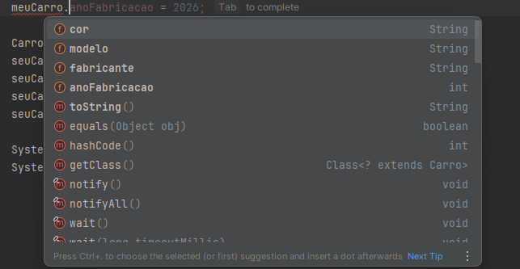
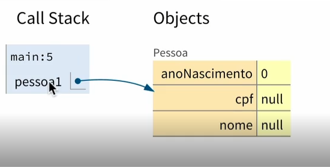

# Anotações

* **classes** - objeto
* **atributos** - características do objeto
* **métodos** - comportamento do objeto
---

> Uma classe após criada também vira um tipo!
> ---

> A classe é apenas um molde, o objeto é criado no new!
> ---

### Os atributos declarados na classe, também é chamado membros das classes

---
#### Composição de objetos
* Um objeto composto pelo outro(isso é muito usado)

### Valores Padrões

> Tipos primitivos 
> * int = 0
> * char = ''
> * double = 0
> * boolean = false

> Classes = null
>----

### MUITO IMPORTANTE!
#### A variavel ela não é um objeto, ela apenas faz referência a um!

* Variável referência ao objeto é um apontamento ao objeto 

 **SUPER ENTENDIDO AGORA**
----

> Métodos
> * para nomes de métodos sempre utilizar um verbo no infinitivo!
> * **assinatura do método é onde ele é declarado! TIPO NOME() {**
> * a variável alocada no parâmetro so existe dentro do bloco!
> * quando informamos que o método tem parâmetros é obrigatório implementar eles!
> * evitar alterar valor de variável recebida pelo parâmetro aula 05.28

### this
* informa que o atributo é da classe.

> **static**
> * informa que a variável não é da instância e sim da classe
> * global, todas as "instancias recebem o mesmo valor"
> * não gostei muito de usar!
> * não faz parte do objeto e sim da classe
> * método de instância não é par alterar o valor de uma variável estática 
> * de instância vs da classe(static)
> * de instância só pode ser acesado quando instanciamos o objeto = new Objeto.
> * Da classe acessamos quando chamamos a classe Obejeto.membro

* chegou um ponto importante, atributos e métodos staticos devem ser esuado em classes utils | helper
* deve se evitar criar métodos staticos, pois não é tão orientado a objetos

> * this não pode ser usado em métodos staticos
> * se por acaso eu precisar receber um atributo estático num método statico devo passalo como parametro
o objeto e utilizar no codigo