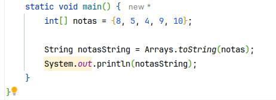

# Anotações

> Declaração
> * TIPO [] NOME_DA_VARIAVEL = new tipo [x]
> * [] pde ser depois do tipo ou depois do nome da varivel

## Array é um OBJETO!

* Um array sempre começa na posição zero!
* as posições também pode ser chamadas: elementos
---

> PARA ACESSA AS POSIÇÕES:
> * NOME_DA_VARIAVEL[0] -> DESSA FORMA ACESSA A PRIMEIRA POSIÇÃO

* Lembrar sempre que para acessar devo começar com 0
  * ENTÃO SE ELA É [10] EU ACESSO DO [0] A [9];
---

* Essa é a melhor forma de iterar um array!
---

### Transformar o array em uma String!

---

## A classe Arrays do pacote util

> Tem uma série de métodos staticos que ajudam muito
> * toString - para converte o array numa string
> * sort - para ordenar